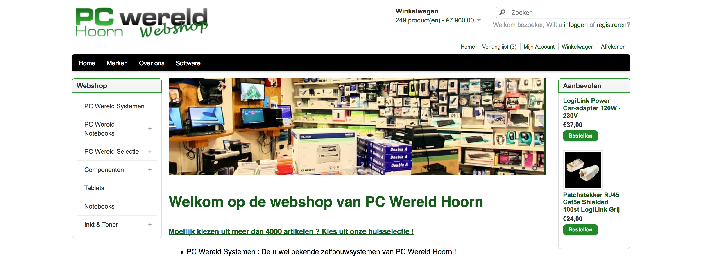
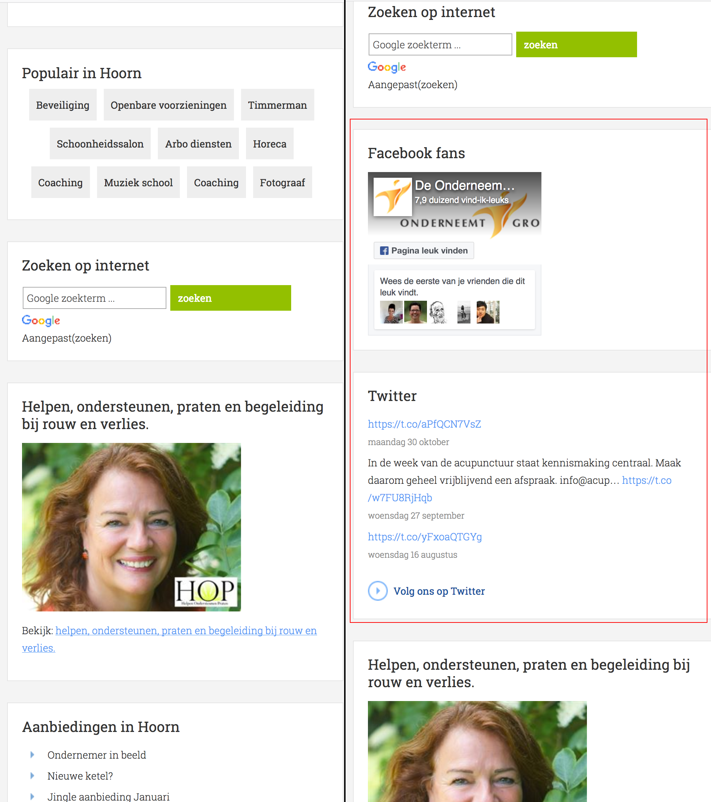

# Browser Technology

## Table of contents
- [Testing](#testing)
<!-- - [Bandwidth limit](#bandwidthlimit) -->

## Testing

### Test 1 (PC wereld)

#### Cookies disabled

[Tested with the website from PC-wereld](http://pcwereld.nl/)

Problems:
- Bought items aren't added to the shopping cart.
- Items can't be added to the wishlist.
- Items can't be compared with each other.

After research the cookies:
The website is saving the server session id in to the client cookies. When the id doesn't match with the server session id, the correct data will not be shown.
See value of `PHPSESSID` in the cookie list

##### Cookie list
| Name | Value | Domain | Path | Expires | Size | HTTP | Secure |
| --- | --- | --- | --- | --- | --- | --- | --- |
| currency | EUR | .pcwereld.nl | / | 11/04/2018, 13:09:22 | 11 | B |
| language | nl | .pcwereld.nl | / | 11/04/2018, 13:09:12 | 10 | B |		
| PHPSESSID | j0t3afqvefng4b76ovetts6f90 | pcwereld.nl | / | Session | 35 | B | ✓ |

#### Bandwidth limit

Does not break.

### Test 2 (hoornonderneemt)
[Tested with the website of hoornonderneemt](https://www.hoornonderneemt.nl/)

#### Cookies disabled
Problems
- When using AdBlock, the `ads/social media` are visible when Cookies are disabled. Which is very strange...

#### Bandwidth limit
